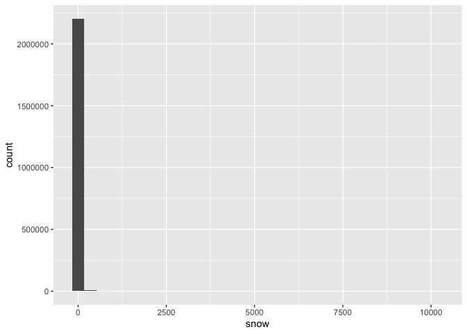
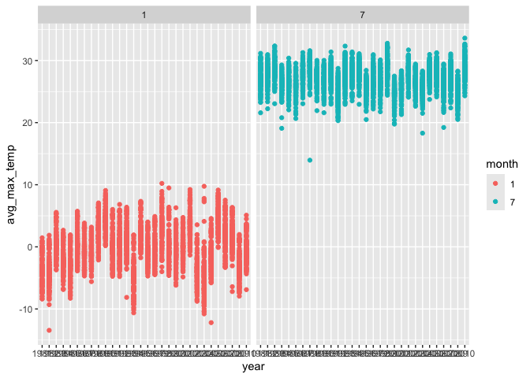
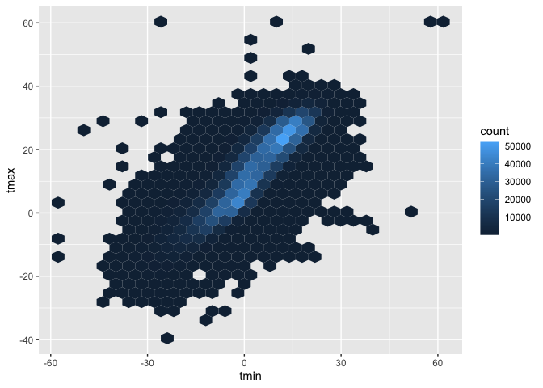
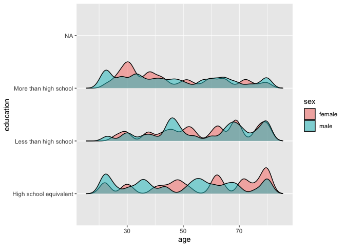
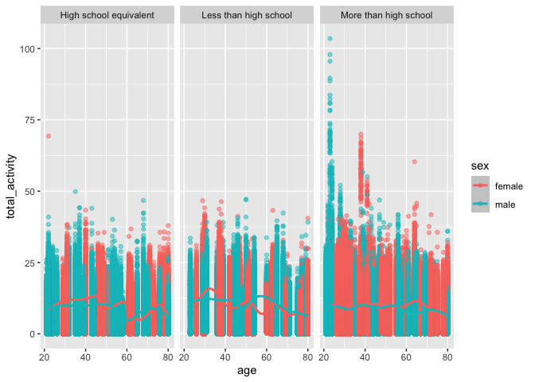

HW3
================
Shayne Estill (ske2118)

The “ny_noaa” dataset has 2595176 rows and 7 columns. From the NY NOAA
information page, The resulting R dataset ny_noaa contains variables:

id: Weather station ID date: Date of observation prcp: Precipitation
(tenths of mm) snow: Snowfall (mm) snwd: Snow depth (mm) tmax: Maximum
temperature (tenths of degrees C) tmin: Minimum temperature (tenths of
degrees C)

The variable types include id(chr), date(date), prcp(int), snow(int),
snwd(int), tmax(chr), and tmin(chr).

There is a significant amount of missing data. There are 145838 missing
precipitation values, 381221 missing snow values, 591786 missing snow
depth values, 1134358 missing max temperature values, 1134420 missing
min temperature values, 0 missing date values, 0 missing ID values

\#Do some data cleaning. Create separate variables for year, month, and
day.

I also changed the new variables for year, month, and day to character.

\###Ensure observations for temperature, precipitation, and snowfall are
given in reasonable units.

The max tmax value is 99 . The min tmin value is -1. This seems
unreasonable for Celsius measures.

The max precipitation value is 22860. This seems unreasonable for tenths
of a mm.

The max snowfall value is 10160. These values don’t make sense. We
should convert these variables from character and int to double.

``` r
ny_noaa_cleaned <-ny_noaa_cleaned |>
  mutate(
    tmax = as.double(tmax, digits = 2),
    tmin = as.double(tmin, digits = 2),
    snow = as.double(snow, digits = 2),
    snwd = as.double(snow, digits = 2)
  )
```

``` r
ny_noaa_cleaned <- ny_noaa_cleaned |>
  mutate(
    tmax = tmax / 10,
    tmin = tmin / 10
  )
```

The max precipitation value is 22860 The max tmax value is 60 The min
tmin value is -59.4

For snowfall, what are the most commonly observed values? Why?

``` r
ny_noaa_cleaned |>
  ggplot(aes(x = snow)) + 
  geom_histogram() 
```

    ## `stat_bin()` using `bins = 30`. Pick better value with `binwidth`.

    ## Warning: Removed 381221 rows containing non-finite outside the scale range
    ## (`stat_bin()`).

<!-- -->

``` r
ny_noaa_cleaned |> 
  group_by(snow) |> 
  summarize(count = n()) |> 
  arrange(desc(count))
```

    ## # A tibble: 282 × 2
    ##     snow   count
    ##    <dbl>   <int>
    ##  1     0 2008508
    ##  2    NA  381221
    ##  3    25   31022
    ##  4    13   23095
    ##  5    51   18274
    ##  6    76   10173
    ##  7     8    9962
    ##  8     5    9748
    ##  9    38    9197
    ## 10     3    8790
    ## # ℹ 272 more rows

From the histogram and output, the most commonly observed snowfall
values are zero, NA, 25 and 13. This is because the majority of the
year, there is no snowfall in New York.

Make a two-panel plot showing the average max temperature in January and
in July in each station across years. Is there any observable /
interpretable structure? Any outliers?

The min year is 1981. The max year is 2010.

``` r
avg_maxtemp <- ny_noaa_cleaned |>
  filter(month == 1| month == 7 ) |>
  group_by(id, month, year) |>
  summarize(avg_max_temp = mean(tmax, na.rm = TRUE))
```

    ## `summarise()` has grouped output by 'id', 'month'. You can override using the
    ## `.groups` argument.

``` r
avg_maxtemp |>
  ggplot(aes(x = year, y = avg_max_temp)) + 
  geom_point(aes(color = month)) + 
  geom_smooth(se = FALSE) +
  facet_grid(. ~ month)
```

    ## `geom_smooth()` using method = 'loess' and formula = 'y ~ x'

    ## Warning: Removed 5970 rows containing non-finite outside the scale range
    ## (`stat_smooth()`).

    ## Warning: Removed 5970 rows containing missing values or values outside the scale range
    ## (`geom_point()`).

<!-- -->

The average max temperature in January is much lower than the average
max temperature in July across all years. There does not appear to be
too much of an outlier.

Make a two-panel plot showing (i) tmax vs tmin for the full dataset
(note that a scatterplot may not be the best option). Make a plot
showing the distribution of snowfall values greater than 0 and less than
100 separately by year.

``` r
tmax_tmin = 
  ny_noaa_cleaned |>
ggplot(aes(x = tmin, y = tmax)) + 
  geom_hex() 

snowfall_dist = 
  ny_noaa_cleaned |>
  filter(snow < 100, snow > 0) |>
  ggplot(aes(x = snow, y = as.factor(year))) + 
  geom_density_ridges(scale = 0.5)

tmax_tmin + snowfall_dist
```

    ## Warning: Removed 1136276 rows containing non-finite outside the scale range
    ## (`stat_binhex()`).

    ## Picking joint bandwidth of 3.76

<!-- -->

\###Problem 2###

Load, tidy, merge, and otherwise organize the data sets. Your final
dataset should include all originally observed variables; exclude
participants less than 21 years of age, and those with missing
demographic data; and encode data with reasonable variable classes
(i.e. not numeric, and using factors with the ordering of tables and
plots in mind).

``` r
demographic_df = read_csv(file = "./HW3_2_files/nhanes_covar.csv",   
  skip = 4) |>
janitor::clean_names() |>
    filter(age > 20) |>
    drop_na(sex, age, education, bmi, seqn) |>
    mutate(
      seqn = factor(seqn)) |> 
    mutate(
    education = case_match(
      education,
      1 ~ "Less than high school",
      2 ~ "High school equivalent",
      3 ~ "More than high school"),
    education = as.factor(education)
    ) |>
mutate(
    sex = case_match(
      sex,
      1 ~ "male",
      2 ~ "female"),
    sex = as.factor(sex)
    )
```

    ## Rows: 250 Columns: 5
    ## ── Column specification ────────────────────────────────────────────────────────
    ## Delimiter: ","
    ## dbl (5): SEQN, sex, age, BMI, education
    ## 
    ## ℹ Use `spec()` to retrieve the full column specification for this data.
    ## ℹ Specify the column types or set `show_col_types = FALSE` to quiet this message.

``` r
accel_df = read_csv(file = "./HW3_2_files/nhanes_accel.csv") |>
  janitor::clean_names() |>
  drop_na() |>
pivot_longer(
    min1:min1440,
    names_to = "obs",
    values_to = "min"
  ) |>
mutate(
    seqn = factor(seqn)) 
```

    ## Rows: 250 Columns: 1441
    ## ── Column specification ────────────────────────────────────────────────────────
    ## Delimiter: ","
    ## dbl (1441): SEQN, min1, min2, min3, min4, min5, min6, min7, min8, min9, min1...
    ## 
    ## ℹ Use `spec()` to retrieve the full column specification for this data.
    ## ℹ Specify the column types or set `show_col_types = FALSE` to quiet this message.

``` r
merged_df = 
  left_join(
    accel_df,
    demographic_df,
    by = join_by(seqn)
  )
```

Produce a reader-friendly table for the number of men and women in each
education category, and create a visualization of the age distributions
for men and women in each education category. Comment on these items.

``` r
  merged_df |>
  group_by(education, sex) |>
  summarize(count = n_distinct(seqn)) |> 
   pivot_wider(
     names_from = sex,
     values_from = count) |>
  knitr::kable()
```

    ## `summarise()` has grouped output by 'education'. You can override using the
    ## `.groups` argument.

| education              | female | male |  NA |
|:-----------------------|-------:|-----:|----:|
| High school equivalent |     23 |   35 |  NA |
| Less than high school  |     28 |   27 |  NA |
| More than high school  |     59 |   56 |  NA |
| NA                     |     NA |   NA |  22 |

It appears that there are more females than males that have more than
high school education and less than high school education while, there
are more males who have high school equivalent education than females.

Create a visualization of the age distributions for men and women in
each education category

``` r
age_dist = 
  merged_df |>
  select(age, education, sex) |>
  group_by(education,sex) |>
  ggplot(aes(x = age, y = education, fill = sex)) + 
  geom_density_ridges(scale = 0.5, alpha = 0.5)

age_dist
```

    ## Picking joint bandwidth of 1.85

    ## Warning: Removed 31680 rows containing non-finite outside the scale range
    ## (`stat_density_ridges()`).

<!-- -->

This matches our previous graph. There is more density around age 30 for
education more than high school.

Traditional analyses of accelerometer data focus on the total activity
over the day. Using your tidied dataset, aggregate across minutes to
create a total activity variable for each participant. Plot these total
activities (y-axis) against age (x-axis); your plot should compare men
to women and have separate panels for each education level. Include a
trend line or a smooth to illustrate differences. Comment on your plot.

``` r
merged_df_totalact <-
  merged_df |>
  drop_na(education, age, bmi, sex, seqn) |>
  group_by(seqn, sex, education, age) |>
  summarize(total_activity = sum(min, na.rm = TRUE)) |>
  ungroup()
```

    ## `summarise()` has grouped output by 'seqn', 'sex', 'education'. You can
    ## override using the `.groups` argument.

``` r
ggplot(merged_df_totalact, 
       aes(x = age, y = total_activity, color = sex)) +
  geom_point(alpha = .5) +
  geom_smooth() + 
  facet_grid(. ~ education) 
```

    ## `geom_smooth()` using method = 'loess' and formula = 'y ~ x'

<!-- -->

Accelerometer data allows the inspection activity over the course of the
day. Make a three-panel plot that shows the 24-hour activity time
courses for each education level and use color to indicate sex. Describe
in words any patterns or conclusions you can make based on this graph;
including smooth trends may help identify differences.

\###Problem 3###

This zip file contains data on rides taken on the NYC Citi Bike system.
Files contain 1% of all rides with a total duration less than 4 hours in
each of four months. Import, clean, and tidy these data, and describe
the resulting dataset.

``` r
citibike_jan20_df = read_csv(file = "./HW3_2_files/citibike/Jan 2020 Citi.csv") |>
  janitor::clean_names() |> 
  mutate(month = "January", year = "2020") |>
  mutate(month_year = "January 2020")
```

    ## Rows: 12420 Columns: 7
    ## ── Column specification ────────────────────────────────────────────────────────
    ## Delimiter: ","
    ## chr (6): ride_id, rideable_type, weekdays, start_station_name, end_station_n...
    ## dbl (1): duration
    ## 
    ## ℹ Use `spec()` to retrieve the full column specification for this data.
    ## ℹ Specify the column types or set `show_col_types = FALSE` to quiet this message.

``` r
citibike_july20_df = read_csv(file = "./HW3_2_files/citibike/July 2020 Citi.csv") |>
  janitor::clean_names() |>
  mutate(month = "July", year = "2020") |>
  mutate(month_year = "July 2020")
```

    ## Rows: 21048 Columns: 7
    ## ── Column specification ────────────────────────────────────────────────────────
    ## Delimiter: ","
    ## chr (6): ride_id, rideable_type, weekdays, start_station_name, end_station_n...
    ## dbl (1): duration
    ## 
    ## ℹ Use `spec()` to retrieve the full column specification for this data.
    ## ℹ Specify the column types or set `show_col_types = FALSE` to quiet this message.

``` r
citibike_jan24_df = read_csv(file = "./HW3_2_files/citibike/Jan 2024 Citi.csv") |>
  janitor::clean_names() |>
  mutate(month = "January", year = "2024") |>
  mutate(month_year = "January 2024")
```

    ## Rows: 18861 Columns: 7
    ## ── Column specification ────────────────────────────────────────────────────────
    ## Delimiter: ","
    ## chr (6): ride_id, rideable_type, weekdays, start_station_name, end_station_n...
    ## dbl (1): duration
    ## 
    ## ℹ Use `spec()` to retrieve the full column specification for this data.
    ## ℹ Specify the column types or set `show_col_types = FALSE` to quiet this message.

``` r
citibike_july24_df = read_csv(file = "./HW3_2_files/citibike/July 2024 Citi.csv") |>
  janitor::clean_names() |>
  mutate(month = "July", year = "2024") |>
  mutate(month_year = "July 2024")
```

    ## Rows: 47156 Columns: 7
    ## ── Column specification ────────────────────────────────────────────────────────
    ## Delimiter: ","
    ## chr (6): ride_id, rideable_type, weekdays, start_station_name, end_station_n...
    ## dbl (1): duration
    ## 
    ## ℹ Use `spec()` to retrieve the full column specification for this data.
    ## ℹ Specify the column types or set `show_col_types = FALSE` to quiet this message.

``` r
citibike_tidy = 
  bind_rows(citibike_jan20_df, citibike_jan24_df, citibike_july20_df, citibike_july24_df)
```

This dataset has information from January 2020, July 2020, January 2024,
and July 2024.

There are 99485 rows and 10 columns in our combined dataset.

Variables include ride_id(chr), rideable_type(chr), weekdays(chr),
duration(dbl), start_station_name(chr), end_station_name (chr),
member_casual (chr), month (chr), year (chr), and month_year (chr)

Produce a reader-friendly table showing the total number of rides in
each combination of year and month separating casual riders and Citi
Bike members. Comment on these results.

``` r
citibike_table <- citibike_tidy |>
  janitor::tabyl(member_casual, month_year)
```

It appears that overall, the number of people using citi bike has grown
from January 2020 to July 2024. Summer months seem to have more frequent
rides than winter months and there are more members than casual riders
in each month_year.

Make a table showing the 5 most popular starting stations for July 2024;
include the number of rides originating from these stations.

``` r
citibike_popular <- citibike_tidy |>
  filter(month_year == "July 2024") |>
  group_by(start_station_name, month_year) |>
  summarize(count = n()) |>
  arrange(desc(count))
```

    ## `summarise()` has grouped output by 'start_station_name'. You can override
    ## using the `.groups` argument.

``` r
head(citibike_popular, 5)
```

    ## # A tibble: 5 × 3
    ## # Groups:   start_station_name [5]
    ##   start_station_name       month_year count
    ##   <chr>                    <chr>      <int>
    ## 1 Pier 61 at Chelsea Piers July 2024    163
    ## 2 University Pl & E 14 St  July 2024    155
    ## 3 W 21 St & 6 Ave          July 2024    152
    ## 4 West St & Chambers St    July 2024    150
    ## 5 W 31 St & 7 Ave          July 2024    146

From our output, Pier 61 at Chelsea Piers had the highest count of
number of rides originating from this station in July 2024.

Make a plot to investigate the effects of day of the week, month, and
year on median ride duration. This plot can include one or more panels,
but should facilitate comparison across all variables of interest.
Comment on your observations from this plot.

There were relatively few electric Citi Bikes in 2020, but many more are
available now. For data in 2024, make a figure that shows the impact of
month, membership status, and bike type on the distribution of ride
duration. Comment on your results.
